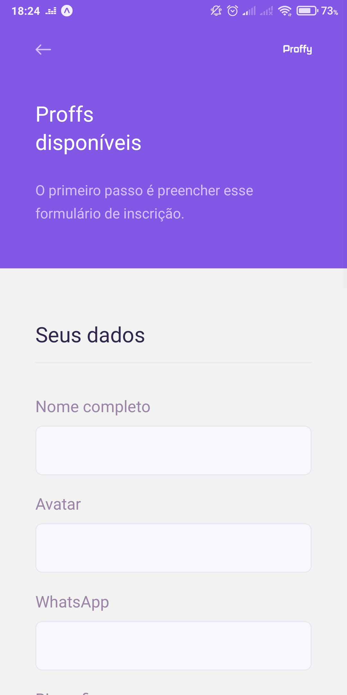

<p align="center">
  </img>
</p>

<p align="center" style="margin: 50px">
  <a href="https://github.com/gcairesdev/proffy">
    </img>
  </a>
  <a href="https://github.com/gcairesdev/proffy/blob/master/LICENSE.md">
    </img>
  </a>
  <a href="https://github.com/gcairesdev/proffy">
    </img>
  </a>
</p>

## Índice

* [Sobre o projeto](#proffy)
  + [Web](#web)
  + [Mobile](#mobile)
  + [Feito com](#feito-com)
  + [Objetivo](#objetivo)
  + [Justificativa](#justificativa)
* [Iniciando](#iniciando)
  + [Pré requisitos](#pré-requisitos)
  + [Instalação](#instalação)
* [Contribuindo](#contribuindo)
* [Autor](#autor)
* [Licença](#licença)

## Proffy

> Conecte-se com professores ou alunos através de nosso sistema multiplataforma!

O Proffy é um sistema multiplataforma para conectar alunos e professores.

### Web

<p align="center">
  </img>
  </img>
  </img>
  </img>
</p>

### Mobile

<p align="center">
  </img>
  </img>
  </img>
  </img>
</p>

## Feito com

* [Back-end - NodeJS](https://nodejs.org/)
* [Front-end - ReactJS](https://reactjs.org/)
* [Mobile - React Native](https://reactnative.dev/)
* [Mobile - Expo](https://expo.io/)
* [DB - SQLite](https://sqlite.org/)

## Objetivo

O objetivo do Proffy é dar um "match" entre professor e aluno.
O professor se cadastra na plataforma e o aluno busca por um dia e hora em que
gostaria de ter aula da matéria escolhida. Os resultados exibidos são de professores
que se cadastraram para aquele dia e hora, e o aluno pode ver os dados desses professores
e escolher qual ele quer entrar em contato via WhatsApp, fazendo assim 1 conexão :)

## Justificativa

O Proffy foi desenvolvido durante a [NLW (Next Level Week)](https://nextlevelweek.com/), organizada pela [RocketSeat](https://rocketseat.com.br/).

## Iniciando

Para iniciar, veja os pré requisitos do projeto.

## Pré requisitos

* [Git](https://git-scm.com/)
* [NodeJS](https://nodejs.org/)
* [Expo](https://expo.io/)
* [SQLite](https://sqlite.org/)

## Instalação

Clone o repositório:

``` git
git clone https://github.com/gcairesdev/proffy
```

Navegue para a pasta do projeto:

``` sh
cd proffy
```

Instale as dependências (nas pastas /server, /web e /mobile):

``` sh
npm install
```

Execute as migrations (na pasta /server):

``` sh
npm run knex:migrate
```

Execute o projeto (nas pastas /server, /web e /mobile):

``` sh
npm start
```

Para o mobile, use o Expo para ler o QR code:

[Google Play](https://play.google.com/store/apps/details?id=host.exp.exponent) ou [Apple Store](https://apps.apple.com/br/app/expo-client/id982107779)

## Autor

|                |                  |          |            |         |
|----------------|------------------|----------|------------|---------|
| ![][githubImg] | Guilherme Caires | [Github] | [Linkedin] | [Email] |

## Contribuindo

Confira a página [CONTRIBUTING](./CONTRIBUTING.md) para ver os melhores locais para arquivar problemas, iniciar discussões e começar a contribuir.

## Licença

Lançado em 2020.
Este projeto está sob a [Licença MIT](./LICENSE.md).

---

<p align="center">
  Feito com :heart: por <a href="https://github.com/gcairesdev">Guilherme Caires</a>
</p>

<!-- Markdown link & img dfn's -->
[Github]: https://github.com/gcairesdev
[GithubImg]: https://avatars.githubusercontent.com/u/54117888?s=100
[Linkedin]: https://linkedin.com/in/guilherme-caires/
[Email]: contatogcaires@gmail.com
